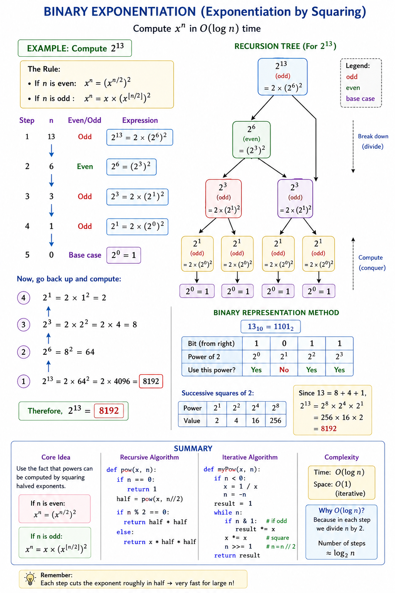

# 1)Counter()

Counter(string) =

1.count()- Built-in  Method (For Lists, Strings, and Tuples)

If you want to count  **all items at once** , import `Counter` from Python's standard `collections` library. It acts like a specialized dictionary where the elements are keys and their frequencies are values

# 2)Empty set initialise

a=set()

# 3)in-place and not-in-place sorting

in-place-doesn't create new object , it rearranges the original object

not-in-place-creates new object

# 4) defaultdict()

a **`defaultdict` is a subclass of the built-in `dict` class** that automatically assigns a default value to a key if it does not already exist, Unlike a standard dictionary, which raises a `KeyError` when you look up a non-existent key, a `defaultdict` calls a user-specified function (called a `default_factory`) to gracefully create and return a default value on the fly

# 5)Mutable and Immutable

mutable=list, set, dict

immutable=int,float,string,tuple

# 6) Counter().most_common()

returns a list of all elements in a `Counter` object and their frequencies, sorted from the most frequent to the least frequent

# 7)The Sieve of Eratosthenes Algorithm

1. **Initialize:** Create a list of boolean values indexed from \(2\) to \(n\), all initially marked as `True` (meaning they are assumed to be prime).
2. **Eliminate:** Start with the first prime number, \(2\). Go through the list and mark all multiples of \(2\) as `False` (e.g., \(4, 6, 8, \ldots\)).
3. **Repeat:** Move to the next number in the list that is marked `True`. Mark all of its multiples as `False`.
4. **Stop condition:** You only need to check multiples for primes up to \(\sqrt{n}\).
5. **Result:** All indices in your list that remain marked `True` after this process are the prime numbers less than or equal to \(n\).

# 8) GCD using Euclidean algorithm

The **Euclidean formula for finding the Greatest Common Divisor (GCD)** of two integers a and b is based on the principle that \(gcd(a, b) = gcd(b, a mod b)\) until the remainder becomes zero. Formally, it is expressed as the piecewise reduction function.

$$
\gcd(a, b) = \begin{cases} a, & \text{if } b = 0 \\ \gcd(b, a \bmod b), & \text{otherwise} \end{cases}
$$

# 9) int max and int min

int_max and int_min is not available in python so to find the min and max we do

INT_MAX=(1<<31)-1

INT_MIN=-(1<<31)

# 10)Armstrong Number

An Armstrong number (or narcissistic number) is =a number that is equal to the sum of its own digits, each raised to the power of the total number of digits

# 11)digital root

digital root= sum untill the sum is single digit for a given number

The elegant mathematical insight is that this "digital root" follows a pattern: it equals (num - 1) % 9 + 1 for positive numbers, or equivalently num % 9 with special handling for 0 and multiples of 9. This avoids iterative summation entirely.

##### Approach

We'll use a mathematical pattern recognition strategy:

1. **Zero case** : If num is 0, digital root is 0
2. **Multiple of 9** : If num % 9 equals 0 (and num ≠ 0), digital root is 9
3. **General case** : For all other numbers, digital root is num % 9
4. **Mathematical property** : This works because repeatedly summing digits is equivalent to finding the remainder when divided by 9
5. **Constant time** : No loops or recursion needed

This approach leverages the mathematical relationship between digital roots and modulo 9.

```python
class Solution:
    def addDigits(self, num: int) -> int:
        if num == 0:
            return 0
        if num % 9 == 0:
            return 9
        return num % 9
```

# 12) Sum of Squares of digit property(happy number)

A **happy number** is =a number that eventually reaches **1** when you repeatedly replace it with the sum of the squares of its digits.

If the process never reaches 1 and instead gets trapped in an infinite loop that repeats the same numbers over and over, it is called an **unhappy** (or sad) number

Trick for happy number is that when it is not a happy number it repeats like in the example of 4

Example 1: Why 19 is Happy

* **Step 1:** 1² + 9² = 1 + 81 = 82
* **Step 2:** 8² + 2² = 64 + 4 = 68
* **Step 3:** 6² + 8² = 36 + 64 = 100
* **Step 4:** \(1^2 + 0^2 + 0^2 = 1 + 0 + 0 = \mathbf{1}\) *(Happy!)*

Example 2: Why 4 is Unhappy

* **Step 1:** 4² = 16
* **Step 2:** 1² + 6² = 37
* **Step 3:** 3² + 7² = 58
* **Step 4:** 5² + 8² = 89
* **Step 5:** 8² + 9² = 145
* **Step 6:** 1² + 4² + 5² = 42
* **Step 7:** 4² + 2² = 20
* **Step 8:** \(2^2 + 0^2 = 4) (Trapped! It loops back to the start and will repeat forever).

# 13) Power Exponentiation

In this basically when the exponent(n) is odd we add it to result*x and when it is even we multiply x*x and n-1 &n//2 respectively



# 14) Recursion

Count and Say problem

# 15) Floyd's Triangle

**Floyd's Triangle** is =a classic right-angled triangular array of natural numbers., named after the computer scientist Robert W. Floyd. It is constructed by filling the rows with consecutive integers, starting with \(1\) in the top-left corner. Each subsequent row contains one more number than the previous one.

For an input of 5 rows, the triangle looks like this:

1
2  3
4  5  6
7  8  9  10
11 12 13 14 15

How It Works

* **Row Number:** The first row has 1 number, the second row has 2, the third has 3, and so on.
* **Total Numbers:** The total count of numbers up to \(n\) rows is given by the formula n*(n+1)/2
* **Progression:** The numbers increase sequentially from left to right, and each new row picks up exactly where the last one left off.

# 16) Pascals triangle

In  **Pascal's triangle** , each number is the sum of the two numbers directly above it as shown:


**Example 1:**

<pre rtrvr-ls="5~hs,6~hs,8~hs,9~hs,49~hs"><strong rtrvr-ls="5~hs,6~hs,8~hs,9~hs">Input:</strong> numRows = 5
<strong rtrvr-ls="5~hs,6~hs,8~hs,9~hs">Output:</strong> [[1],[1,1],[1,2,1],[1,3,3,1],[1,4,6,4,1]]</pre>
